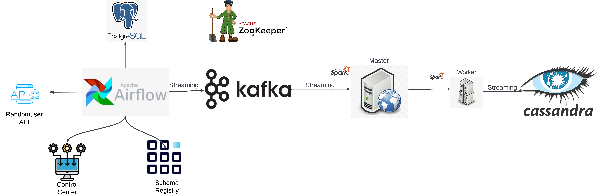

# Kafka-Stream with Airflow, Spark, Cassandra, and Docker

## Project Overview
This project demonstrates a real-time streaming pipeline using modern big data technologies. It integrates data from an external API into a Kafka topic and processes it through a Kafka stream, showcasing a microservices architecture.

## Technologies Used
- Apache Kafka
- Apache Zookeeper
- Apache Airflow (Running on PostgreSQL)
- Apache Spark
- Cassandra
- Docker Compose
- Python

## Key Features
- Fetches real-time data from an external API (randomuser.me)
- Streams data to a Kafka topic
- Uses Zookeeper for distributed coordination of Kafka
- Orchestrates data workflows with Airflow
- Utilizes Spark for distributed data processing
- Implements NoSQL storage with Cassandra
- Containerized with Docker for easy deployment and scaling

## Architecture

## Architecture Highlights
- Microservices-based design
- Real-time data streaming
- Scalable and distributed processing
- Distributed coordination with Zookeeper
- Containerized services for portability

## Skills Demonstrated
- Big Data Technologies
- Stream Processing
- Distributed Systems
- Container Orchestration
- Python Programming
- API Integration
- Data Pipeline Design
- Distributed Coordination

## Future Enhancements
- Implement Kafka consumer for data processing
- Integrate real-time Spark streaming
- Store processed data in Cassandra

This project showcases proficiency in modern data engineering practices, including working with distributed systems, real-time data processing, and containerization technologies.
